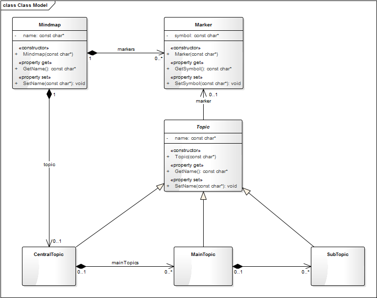

# Mindmap example for [CollabServer](https://github.com/collabserver/)

## Overview

This is a demonstrator project for the [CollabServer Framework](https://github.com/collabserver/).

---

## Build (CMake)


- Requirements
  - [CMake](https://cmake.org/)
  - C++11
  - `pragma once` support
  - Tested with gcc 4.8.4
  - Tested with clang 5.0.0
  - Tested only on Linux. No support certified for Mac and Windows

```bash
# Build the tests

mkdir build
cd build
cmake ..
make

# Or use the build script
./build.sh
```

| CMake option | Description |
| --- | --- |
| CMAKE_BUILD_TYPE | Debug, Release, RelWithDebInfo, MinSizeRel |

---

## Mindmap domain model



---

## Mindmap client commands

* ```CREATE [type] [name]``` - Creates an instance with name ```[name]``` of the domain-specific type ```[type]```.
* ```CREATE association [type] [sourceName] [targetName]``` - Creates an instance of the association type ```[type]``` between the correspondingly typed objects named ```[sourceName]``` and ```[targetName]```, respectively.
   *  Note, that both ```CREATE``` commands conform to the same abstract signtaure ```CREATE [logicalType] [domaintype] [namedReference..]```, where ```[domainType]``` is the reference to the domain-specific type, and ```[logicalType]``` is the reference to the logical level type (present at the API), with the added syntactic sugar of ```Entity``` being the default ```[logicalType]```. For details on domain-specific vs logical types, see [this overview](https://raw.githubusercontent.com/david-istvan/collabserver-example-mindmap/main/model/mapping.png).
* ```READ``` - Returns the mindmap model in a readable form.
* ```UPDATE [name] [property] [value]``` - Updates property ```[property]``` in object ```[name]``` to value ```[value]```.
* ```DELETE [name]``` - Deletes object ```[name]```.
